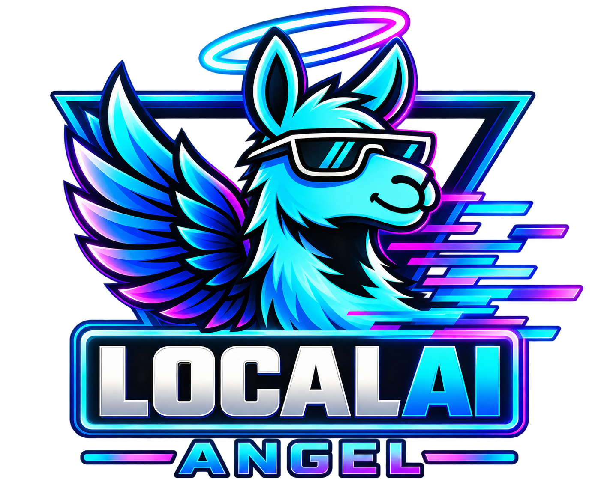

<h1 align="center">
  <br>
   <br>
<br>
</h1>

<h1 align="center">LOCALAI-ANGEL</h1>

<p align="center">
<strong>LocalAI + Angel Nexus</strong>
</p>

<p align="center">
AI • Repositories • Modules • Knowledge • Workspace
</p>

---

> LocalAI provides the foundation.
>
> Angel provides the experience.
>
> Nexus provides the coordination.

---

## Table of Contents

- [Why I Built This](#why-i-built-this)
- [What Is LocalAI-Angel?](#what-is-localai-angel)
- [What Is Angel Nexus?](#what-is-angel-nexus)
- [Current Features](#current-features)
  - [Angel Nexus Workspace](#angel-nexus-workspace)
  - [GitHub Integration](#github-integration)
  - [Easy Windows Operations](#easy-windows-operations)
- [Knowledge System Vision](#knowledge-system-vision)
- [Knowledge With Provenance](#knowledge-with-provenance)
- [Future Development Goals](#future-development-goals)
- [Relationship To LocalAI](#relationship-to-localai)
- [Philosophy](#philosophy)
- [Development Status](#development-status)
- [Credits](#credits)
- [License & Attribution](#license--attribution)

---

## Why I Built This

I started with LocalAI because it provides one of the most powerful open-source foundations for running AI locally.

LocalAI-Angel is my attempt to build the layer that sits above that foundation.

The vision is not simply to run models.

The vision is to create a connected environment where AI, repositories, modules, tools, services, and knowledge can exist together inside a single workspace.

Instead of constantly switching between applications, documentation, GitHub projects, deployment tools, and AI interfaces, LocalAI-Angel aims to bring those resources together under one roof.

```text
LOCALAI-ANGEL
        │
        ▼
    Angel Nexus
        │
 ┌──────┼──────┐
 │      │      │
GitHub Modules Knowledge
 │      │      │
 └──────┼──────┘
        │
        AI
```

---

## What Is LocalAI-Angel?

LocalAI-Angel is an independent development build based on the LocalAI project.

While LocalAI focuses on inference, APIs, agents, hardware acceleration, and model execution, LocalAI-Angel focuses on creating a richer ecosystem around those capabilities.

This repository serves as the development home for Angel Nexus and other features designed to make LocalAI easier to work with, easier to expand, and easier to connect with real-world projects.

---

## What Is Angel Nexus?

Angel Nexus is the coordination layer behind LocalAI-Angel.

Most users will interact with LocalAI-Angel.

Nexus works quietly behind the scenes, connecting repositories, modules, tools, services, workflows, and future knowledge systems.

Think of Nexus as the nervous system of the platform.

Its purpose is to help different parts of the ecosystem communicate, organize, and work together inside one environment.

---

## Current Features

### Angel Nexus Workspace

- Dedicated Angel Nexus workspace
- Integrated repository management
- Module support
- API integration with LocalAI services
- Docker and Compose deployment support
- Angel-specific interface enhancements
- Startup and diagnostic utilities

### GitHub Integration

GitHub is a core part of the Angel Nexus vision.

Most AI systems treat GitHub as a location where code is stored.

Angel Nexus treats GitHub as part of the workspace itself.

Repositories are more than code.

They contain tools, documentation, modules, knowledge, solutions, and development history.

The goal is to make repositories feel like active components of the ecosystem rather than external resources users must constantly switch between.

Current capabilities include:

- Repository discovery
- Repository inspection
- Module management
- Module installation
- Catalog synchronization
- Workspace integration

Long term, Angel Nexus is being developed toward a future where projects, repositories, documentation, tools, and AI workflows can operate together from a single environment while remaining connected to GitHub.

### Easy Windows Operations

Start:

```bat
START_ANGEL.bat
```

Stop:

```bat
STOP_ANGEL.bat
```

Diagnose:

```bat
DIAGNOSE_ANGEL.bat
```

The goal is simple:

**Start it. Use it. Stop it.**

---

## Knowledge System Vision

A major objective of Angel Nexus is the development of curated and inspectable knowledge.

Rather than relying entirely on model memory, future versions will support knowledge collections built around specific subjects such as:

- GitHub
- Docker
- LocalAI
- Angel Nexus
- Installation procedures
- Troubleshooting
- Project architecture
- Development workflows

The objective is improved grounding, greater transparency, and more reliable answers.

---

## Knowledge With Provenance

```text
Experience
      ↓
Raw Information
      ↓
Observation
      ↓
Trace / Provenance
      ↓
Reflection
      ↓
Knowledge Candidate
      ↓
Reviewed Knowledge
      ↓
Revision
      ↓
Current Understanding
```

Knowledge should be connected to evidence whenever possible.

The long-term vision is to make important information traceable, reviewable, correctable, and understandable.

---

## Future Development Goals

- Curated knowledge packs
- Advanced repository integration
- Cross-project workflows
- Additional Nexus modules
- Better retrieval and grounding
- Offline-first capabilities
- Development assistants
- Diagnostics and repair tools
- Backup and recovery workflows
- Permission-aware tool execution
- AI-assisted software development
- Expanded workspace management

These represent future development goals rather than completed functionality.

---

## Relationship To LocalAI

LocalAI-Angel would not exist without the incredible work of the LocalAI project and its contributors.

This README focuses only on LocalAI-Angel additions and Angel Nexus development.

For complete LocalAI documentation, installation instructions, supported models, APIs, agents, MCP support, backends, and hardware acceleration, please visit the upstream project:

**LocalAI**

https://github.com/mudler/LocalAI

**Documentation**

https://localai.io

---

## Philosophy

LocalAI provides the foundation.

Angel provides the experience.

Nexus provides the coordination.

Together they create a more connected AI ecosystem.

---

## Development Status

**Active Development / Experimental**

LocalAI-Angel is being developed incrementally with an emphasis on:

- Stability
- Recoverability
- Transparency
- Modularity
- Knowledge grounding
- Ecosystem integration

---

## Credits

Special thanks to:

- Ettore Di Giacinto
- The LocalAI Team
- LocalAI Contributors
- The Open Source Community

Original Project:

https://github.com/mudler/LocalAI

---

## License & Attribution

LocalAI-Angel is based on the open-source LocalAI project and retains all required upstream licensing and attribution.

Please refer to the LocalAI repository and included license files for original licensing information.

Angel Nexus-specific functionality and additions are developed as part of the LocalAI-Angel project.
