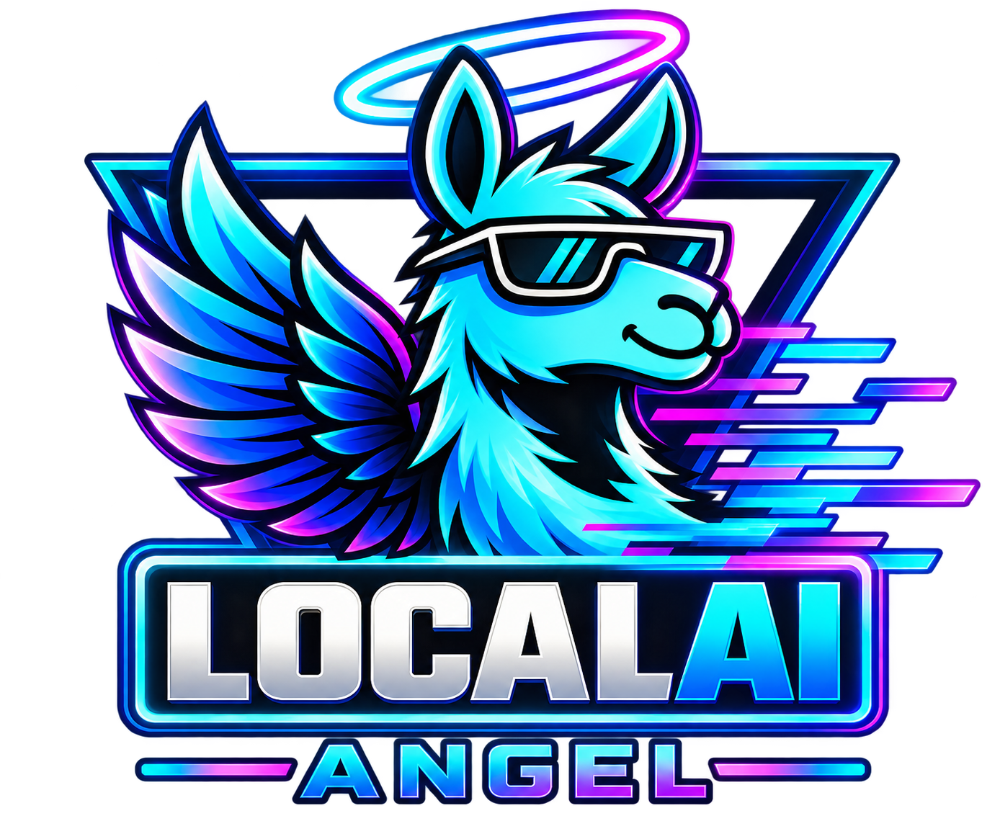
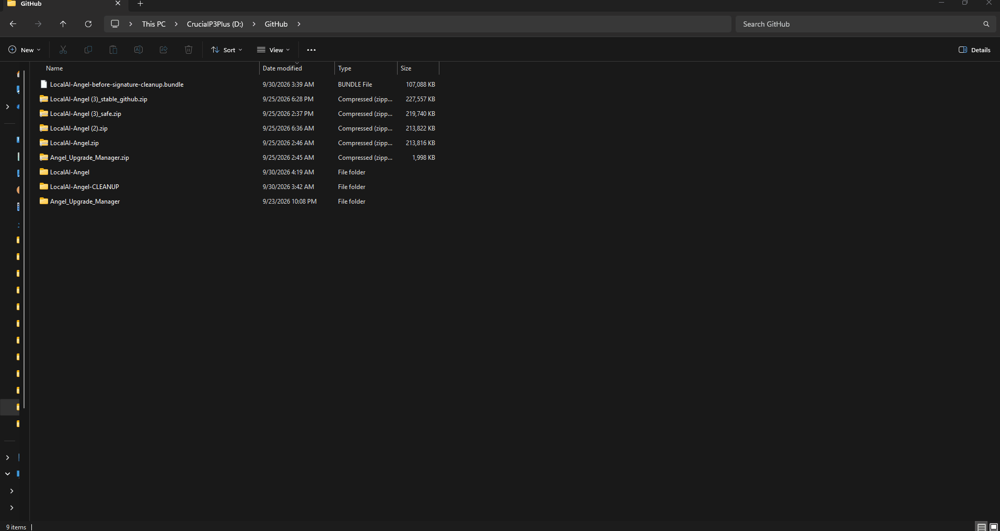

<h1 align="center">
  <br>
  
  <br><br>
</h1>

<h1 align="center">LOCALAI-ANGEL</h1>

<p align="center">
<strong>LocalAI + Angel Nexus</strong>
</p>

<p align="center">
AI • Repositories • Modules • Knowledge • Workspace
</p>

---

> LocalAI provides the foundation.
>
> Angel provides the experience.
>
> Nexus provides the coordination.

---

## 🚀 See It In Action

<p align="center">
  
</p>

<p align="center">
<strong>LocalAI-Angel running with the Angel Nexus workspace and integrated development tooling.</strong>
</p>

---

## Why I Built This

I started with LocalAI because it provides a powerful open-source foundation for running AI locally.

LocalAI-Angel is my independent development effort to build the layer above that foundation: a connected workspace where AI, repositories, modules, tools, services, workflows, and knowledge can work together.

Instead of constantly switching between AI interfaces, GitHub projects, documentation, deployment tools, and development utilities, LocalAI-Angel aims to bring those resources together in one environment.

```text
LOCALAI-ANGEL
        │
        ▼
    Angel Nexus
        │
 ┌──────┼──────┐
 │      │      │
GitHub Modules Knowledge
 │      │      │
 └──────┼──────┘
        │
        AI
```

---

## What Is LocalAI-Angel?

LocalAI-Angel is an independent development build based on the LocalAI project.

LocalAI provides the underlying AI inference platform, APIs, agents, model execution, and backend capabilities. LocalAI-Angel focuses on building an additional ecosystem around those capabilities through Angel Nexus, modular tooling, repository integration, workspace management, and future knowledge systems.

This repository is the development home for Angel Nexus and related LocalAI-Angel additions.

---

## What Is Angel Nexus?

Angel Nexus is the coordination layer behind LocalAI-Angel.

Nexus connects repositories, modules, tools, services, workflows, and future knowledge systems so they can be managed from one workspace.

Think of Nexus as the coordination system that helps the different parts of the platform communicate and operate together.

---

## Current Features

### 🧩 Angel Nexus Workspace

- Dedicated Angel Nexus workspace
- Integrated repository management
- Module support
- LocalAI service integration
- Docker and Docker Compose deployment support
- Angel-specific interface enhancements
- Startup and diagnostic utilities

### 🐙 GitHub Integration

GitHub is a core part of the Angel Nexus architecture.

Repositories can contain more than source code. They can also contain tools, modules, documentation, knowledge, workflows, and reusable solutions.

Current capabilities include:

- Repository discovery
- Repository inspection
- Module management
- Module installation
- Catalog synchronization
- Workspace integration

The long-term goal is to make repositories active components of an AI development environment rather than resources users must constantly switch away from.

### 🪟 Easy Windows Operations

Start:

```bat
START_ANGEL.bat
```

Stop:

```bat
STOP_ANGEL.bat
```

Diagnose:

```bat
DIAGNOSE_ANGEL.bat
```

The goal is simple:

**Start it. Use it. Stop it.**

---

## 🧠 Knowledge System Vision

A major objective of Angel Nexus is the development of curated and inspectable knowledge.

Future knowledge collections may be organized around subjects such as:

- GitHub
- Docker
- LocalAI
- Angel Nexus
- Installation procedures
- Troubleshooting
- Project architecture
- Development workflows

The objective is stronger grounding, greater transparency, and more reliable answers.

---

## 🔎 Knowledge With Provenance

```text
Experience
      ↓
Raw Information
      ↓
Observation
      ↓
Trace / Provenance
      ↓
Reflection
      ↓
Knowledge Candidate
      ↓
Reviewed Knowledge
      ↓
Revision
      ↓
Current Understanding
```

Important information should be connected to evidence whenever possible.

The long-term vision is to make knowledge traceable, reviewable, correctable, and understandable.

---

## 🛠️ Future Development Goals

- Curated knowledge packs
- Advanced repository integration
- Cross-project workflows
- Additional Nexus modules
- Better retrieval and grounding
- Offline-first capabilities
- Development assistants
- Diagnostics and repair tools
- Backup and recovery workflows
- Permission-aware tool execution
- AI-assisted software development
- Expanded workspace management

These represent future development goals rather than completed functionality.

---

## Relationship To LocalAI

LocalAI-Angel is based on the open-source LocalAI project and builds additional Angel Nexus functionality around that foundation.

For complete LocalAI documentation, installation instructions, supported models, APIs, agents, MCP support, backends, and hardware acceleration, visit:

**LocalAI**

https://github.com/mudler/LocalAI

**Documentation**

https://localai.io

---

## Philosophy

LocalAI provides the foundation.

Angel provides the experience.

Nexus provides the coordination.

Together they form a more connected local AI development environment.

---

## Development Status

**Active Development / Experimental**

LocalAI-Angel is being developed incrementally with an emphasis on:

- Stability
- Recoverability
- Transparency
- Modularity
- Knowledge grounding
- Ecosystem integration

The demonstration above represents the project in active development; features and interfaces may change as the platform evolves.

---

## Credits

Special thanks to:

- Ettore Di Giacinto
- The LocalAI Team
- LocalAI Contributors
- The Open Source Community

Original Project:

https://github.com/mudler/LocalAI

---

## License & Attribution

LocalAI-Angel is based on the open-source LocalAI project and retains the applicable upstream licensing and attribution.

Please refer to the LocalAI repository and included license files for original licensing information.

Angel Nexus-specific functionality and additions are developed as part of the LocalAI-Angel project.
